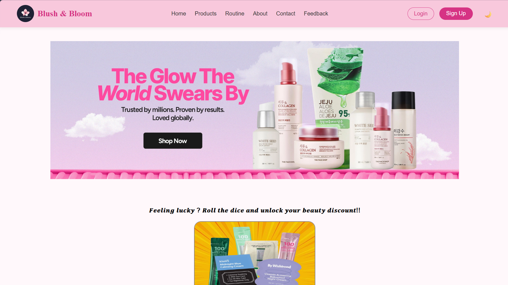

## Blush & Bloom - Skincare Website

Blush & Bloom is a simple and user-friendly skincare website created using HTML, CSS, and JavaScript.
The website helps users explore skincare products, learn daily skincare routines, and interact with different features like product search, image gallery, and theme toggle.

📌 Project Objective

The objective of this project is to create a responsive and interactive skincare website that allows users to:

- Browse skincare products
- Learn morning and night skincare routines
- Search products easily
- Interact with dynamic website features

🛠 Technologies Used

- HTML
- CSS
- JavaScript
- Git & GitHub

✨ Features

- Responsive Navbar and Footer
- Product Gallery using JavaScript
- Array and Loop functions for product display
- Add to Cart button effect
- Product Search functionality
- Theme Toggle (Light/Dark Mode)
- Image Gallery
- Responsive Design using Media Queries

---

📂 Website Pages

- Home (Index)
- About
- Product
- Routine (Morning & Night)
- Feedback
- Contact
- Login
- Sign Up

🚀 How to Run the Project

1. Clone the repository
2. Open the project folder in VS Code
3. Run index.html in your browser

---

📌 Project Type

Academic Mini Project – Web Development

## 👩‍💻 Contributors

